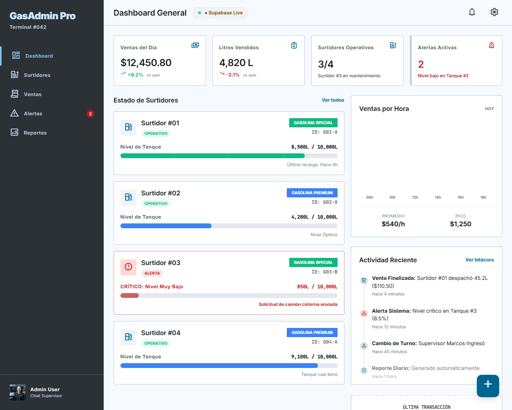

#  Sistema de Gestión de Estación de Servicio

Sistema multiplataforma para el monitoreo en tiempo real de surtidores de combustible, registro de ventas, control de inventario y gestión de alertas críticas.

**Autor:** Leonardo Nogales Torres

---

##  Stack Tecnológico

* **Frontend:** VanillaJS
* **Backend & Base de Datos:** Supabase
* **Arquitectura:** MVC + Patrones de Diseño
* **UI / Diseño:** [Ver prototipo en Figma](https://www.figma.com/design/YXk5gWIib7JWlLfUCoCAQD/Surtidor?node-id=0-1&t=MfZh1w3OqIcVFnFr-1)
* **Despliegue:** Vercel
* **Calidad & Testing:** *(En desarrollo)*

---

## Vista previa del proyecto

---

##  Arquitectura y Patrones de Diseño *(En desarrollo, dispuesto a cambio)*

El núcleo de la aplicación utiliza tres patrones de diseño fundamentales para garantizar escalabilidad y desacoplamiento:

1. **Factory Pattern (Creacional):** Instanciación dinámica de objetos de la clase `Surtidor` según el tipo de combustible (*Gasolina Premium, Especial, Diesel, GNV*).
2. **Adapter Pattern (Estructural):** Abstracción de la capa de persistencia (`DatabaseAdapter`) para alternar fluidamente entre almacenamiento local (*SQLite*) y almacenamiento en la nube (*Supabase*).
3. **Observer Pattern (Comportamiento):** Suscripción en tiempo real a los eventos de los surtidores para el disparo de alertas instantáneas cuando el nivel cae por debajo del umbral crítico.

###  Lógica de Bajo Nivel (Aritmética Binaria) *(En desarrollo, dispuesto a cambio)*

Los estados operativos del surtidor (*Activo, Inactivo, Mantenimiento, Alerta Nivel Bajo, Fuga*) se almacenan comprimidos mediante **máscaras de bits (bitmasks)** en la columna `estado_mask`. Los reportes ejecutan decodificadores con operaciones *bitwise* (`&`, `|`, `>>`) para descomprimir y presentar el diagnóstico.

---

## Cronograma de Desarrollo

| Fase | Contenido | Estado |
|---|---|---|
| **Fase 1 – Diseño e Infraestructura** | Repositorio, esquema SQLite, wireframes en Figma | 🔄 En curso |
| **Fase 2 – Núcleo de Sistemas Digitales** | Clases/funciones de lógica binaria, decodificador y compuertas de alerta | ⬜ Pendiente |
| **Fase 3 – CRUDs y Patrones** | Interfaces de Surtidores, Ventas y Reportes con Singleton/Repository/Observer | ⬜ Pendiente |
| **Fase 4 – Calidad y Despliegue** | Pruebas unitarias, SonarQube, deploy en Vercel/Render | ⬜ Pendiente |

---
