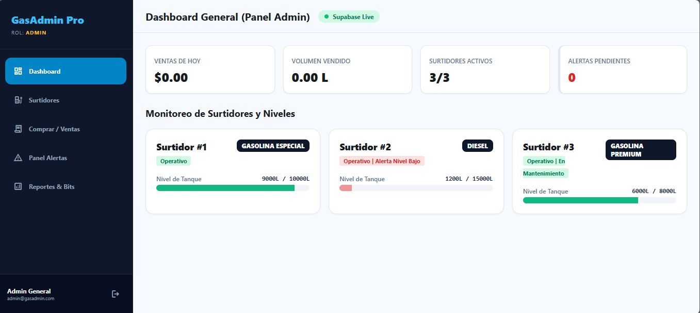

#  Sistema de Gestión de Estación de Servicio (GasAdmin Pro)

Sistema web para el monitoreo en tiempo real de surtidores de combustible, registro de ventas, control de inventario, reabastecimiento y gestión de alertas críticas mediante arquitectura orientada a objetos, patrones de diseño y lógica de bajo nivel.

**Autor:** Leonardo Nogales Torres

---

##  Stack Tecnológico

* **Frontend:** Vanilla JavaScript (ES6+ Modules) + HTML5 + Tailwind CSS
* **Backend & Base de Datos:** Supabase (PostgreSQL, Realtime WebSockets)
* **Arquitectura:** MVC (Modelo-Vista-Controlador) + Patrones de Diseño
* **UI / Prototipado:** [Ver prototipo en Figma](https://www.figma.com/design/YXk5gWIib7JWlLfUCoCAQD/Surtidor?node-id=0-1&t=MfZh1w3OqIcVFnFr-1)
* **Despliegue:** Vercel
* **Testing:** Jest *(Pruebas unitarias de lógica binaria)*

---

##  Vista Previa del Proyecto



---

##  Credenciales de Acceso para Pruebas

El sistema cuenta con un control de acceso basado en roles (**RBAC**):

* **👑 Administrador** (Acceso total: Dashboard, Alertas Realtime, Diagnóstico Bitwise, Reabastecimiento de Surtidores)
  * **Email:** `admin@gasadmin.com`
  * **Password:** `admin123`

* **👤 Cliente / Operario** (Acceso limitado: Selección de surtidor y compra/despacho de combustible)
  * **Email:** `juan@gmail.com`
  * **Password:** `user123`

---

##  Arquitectura y Patrones de Diseño

El sistema está estructurado bajo el patrón **MVC (Modelo-Vista-Controlador)** en JavaScript puro sin dependencias pesadas, incorporando tres patrones fundamentales:

1. **Factory Pattern (Creacional):** Instanciación dinámica de objetos de la clase `Surtidor` aplicando configuraciones y comportamientos según el tipo de combustible (*Gasolina Especial, Premium, Diesel, GNV*).
2. **Adapter Pattern (Estructural):** Abstracción de la capa de datos (`SupabaseAdapter`) que encapsula las peticiones a la API REST de Supabase, manteniendo desacoplada la interfaz de usuario de la persistencia.
3. **Observer Pattern (Comportamiento):** Suscripción mediante `AlertaObserver` al canal de WebSockets de Supabase (`realtime`) para notificar instantáneamente al panel del Administrador sobre eventos críticos sin recargar la página.

---

##  Nivel Técnico: Aritmética Binaria y Decodificador

Para optimizar el almacenamiento de hardware, los estados operativos del surtidor se comprimen en un solo entero utilizando una **máscara de bits (bitmask)** en la columna `estado_mask`:

* **`Bit 0 (1)`**: OPERATIVO (`0001`)
* **`Bit 1 (2)`**: ALERTA_NIVEL_BAJO (`0010`) — *Activado automáticamente por Trigger en BD cuando el stock cae a ≤ 15%*
* **`Bit 2 (4)`**: MANTENIMIENTO_REQUERIDO (`0100`)
* **`Bit 3 (8)`**: FUGA_DETECTADA (`1000`)

La clase `BitwiseDecoder` ejecuta operaciones binarias a nivel de bits (`&`, `|`, `~`) para descomprimir y renderizar dinámicamente las banderas de diagnóstico en la pantalla de Reportes.

---

##  Automática en Base de Datos (PostgreSQL Triggers)

1. **Trigger de Venta (`trigger_procesar_venta`):** Al registrar una compra en la tabla `ventas`, descuenta los litros del nivel del surtidor. Si el stock cae por debajo del **15%**, registra una alerta en la tabla `alertas` y enciende el **Bit 1** (`estado_mask | 2`).
2. **Trigger de Reabastecimiento (`trigger_procesar_reabastecimiento`):** Cuando el Admin recarga un surtidor mediante la tabla `reabastecimientos`, suma los litros y, al superar el **15%**, apaga automáticamente el **Bit 1** (`estado_mask & ~2`), limpiando el estado crítico.

---

##  Estructura del Proyecto

```text
Progra_IV_Surtidor/
├── index.html              # Dashboard Principal (Admin)
├── surtidores.html         # Vista de Surtidores y Reabastecimiento
├── ventas.html             # Punto de Venta / Compra de Cliente
├── alertas.html            # Panel de Alertas en Tiempo Real (Admin)
├── reportes.html           # Reportes y Diagnóstico Bitwise (Admin)
├── login.html              # Autenticación y Selección de Rol
├── js/
│   ├── config/
│   │   └── supabase.js     # Cliente e inicialización de Supabase
│   ├── components/
│   │   └── Sidebar.js      # Menú dinámico y control de accesos
│   ├── patterns/           # PATRONES DE DISEÑO
│   │   ├── factory/        # SurtidorFactory.js
│   │   ├── adapter/        # SupabaseAdapter.js
│   │   └── observer/       # AlertaObserver.js
│   ├── utils/
│   │   └── BitwiseDecoder.js # Lógica de bajo nivel (Bitwise Operators)
│   └── controllers/        # Controladores MVC (Dashboard, Ventas, etc.)
└── README.md
```
---

##  Cronograma de Desarrollo

| Fase | Contenido | Estado |
|---|---|---|
| **Fase 1 – Setup, Base de Datos & Roles** | Repositorio GitHub, Esquema relacional en Supabase (PostgreSQL), Triggers automáticos, Control RLS y Sistema de Autenticación por Roles (*Admin / Cliente*). | ✅ Completado |
| **Fase 2 – UI/UX & Maquetación Web** | Prototipado e interfaz Web Responsive en Vanilla JS + Tailwind CSS (Dashboard, Surtidores, Punto de Venta, Panel de Alertas y Reportes). | ✅ Completado |
| **Fase 3 – Patrones de Diseño & Lógica MVC** | Implementación de **Factory** (Instanciación de Surtidores), **Adapter** (Persistencia Supabase) y **Observer** (Alertas en Tiempo Real) integrados en controladores MVC. | ✅ Completado |
| **Fase 4 – Núcleo Binario & Diagnóstico** | Funciones de Aritmética Binaria Operadores **Bitwise** y Decodificador de `estado_mask` para reportes técnicos de hardware. | ✅ Completado |
| **Fase 5 – Calidad, Testing & Deploy** | Pruebas unitarias en Jest, análisis estático de código en SonarQube y despliegue continuo en Vercel/Render. | 🔄 En curso |

---
